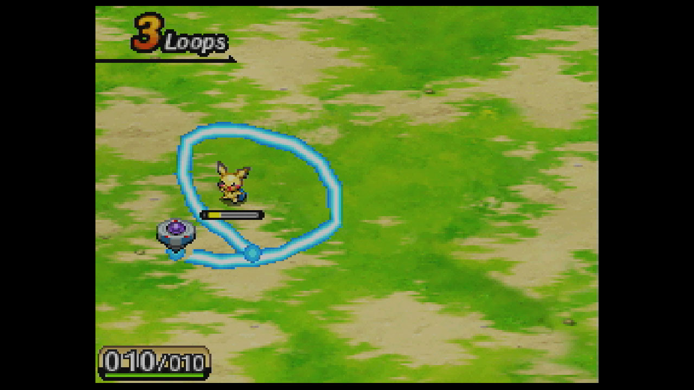

# Duck Ranger Devlog 

## Making Pokemon Ranger with Ducks

> *DS box of the second pokemon Ranger Game: Shadow Of Almia with ducks on it*

I have some game ideas that are stuck in a part of my mind. I know that I want to make them real someday if I have the time and the energy. One of them is to do a Pokemon Ranger like. I always liked theses games and I'm really frustraded they stop making them in 2010.

For thoses who don't know Pokemon Ranger is a spin off of the pokémon games where you play as a Pokémon Ranger. Instead of catching your pokémons in turn based battle you **"capture"** them by **making circles** around them. You can then use the pokemon you captured to help you capture other pokemon or to solve puzzle on the overworld.

>*Capture system in the 3rd Game: Guardian Sign*

In 2024/25 I push myself to learn the **Godot Engine**, I really enjoyed exploring this soft but I wanted to have a project to go somewhere and to see my progression. Enter my want to make a Pokemon Ranger Like on PC and mainly mobile. The touch screen of the DS was the core of the main mechanic of the pokémon ranger games and that's something we can find on mobile today. 

## My plan for this project 

I still don't have a lot figured out of what I want to do with this project. I know I want to have something finished (even if it's small) that can run on Mobile and PC with a lot of feedbacks. 

Because I want to do something small, I will first focus on the "Cature" mechanic of the game and then I'll find a way to put it in a bigger gameplay loop. My main ideas for now are a rogue like or a tiny adventure game. 

This are the main mechanic I loved in the Pokemon games that I want in my project : 

I use **C#** in godot with this project because I'm more comforable with it.

|   |                | |
|---|----------------|--|
| ⭕ | **Capture**    | By tracing circle around a duck you can capture it                        
| 🆘 | **Support**    | The captured duck can help you in battle
| 🦆 | **Collecting** | You'll have to find a lot of various ducks with their own skin and ability

At a learning point theses are my objectives for this project :

- 💻 Making progress with godot and to have a flexible project that can be extended
- 🎨​ Be happy with my art
- 💥 Add a lot of feedbacks and juice 
- 🎶 Making music for the first time in a project

## Why Ducks ? 

Beacause they are adorable. And also it's the only thing I can draw. (Quack)

