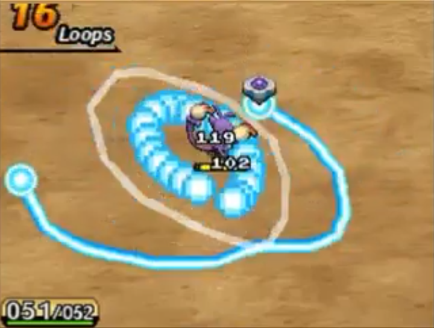
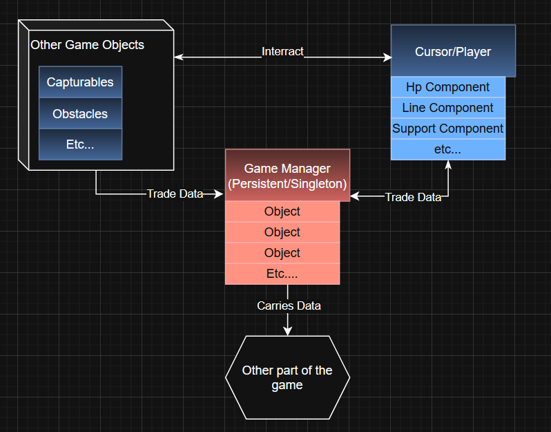

# Sprint 2 -

> Start : 14/06/2026  
> End : 28/06/2026

After few month without looking at the project for personal reasons I slowly noted some ideas until I decided to fully get back on it. 

I was pleased to see that my code wasn't so bad even if I could always improve. After looking at my last devlog I identified some goals for this sprint. 

I'm also not sure of which structure is the best to support the capture gameplay (adventure or rogue-like or something else). I like the scalability of the rogue like but I also like the mystery/easter-egg/search for the rare encounters of the adventure games. 

## Goals 

### Producing
- Make a Moscow for the project
- Put this devlog and the project on my website
- Decide a clear objective/project end  
- Godot R&D

### Design 
- Decide between linear adventure or roguelike
- If I decide start working on environement/Level/Biome etc....
- Design secondary mechanics (How to use support ducks, XP, Shops etc....)
- Document and design some duck abilities 
- Design how combo affect capture rate
- R&D design tools (Obsidian?)
  
### Code
- Implement a singleton manager system
- Make the capture mechanic work on more than one ducks
- Make the duck attack system 
- Make the duck support system 
- Add Combo/Number of loop/etc...
- Start working on the support gameplay loop (xp/Shop/etc...)
### Art 
- Try particles in godot
- Try to do some mockup/rough background
- Try to do some mockup/rough UI 
- Low priority but it's always fun to design ducks


## Design 

### Combo 

Combos are a way to reward skilled player who can do a lot of circle uninterupted by Ducks attacks or other traps.

In Pokemon ranger every 5 loops add 1/4 of the original capture rate to the capture rate. 



> For example if your starting capture rate is 12 it should evolve like this :
> |Combo|Capture rate|
> |-|-|
> |1-5|12|
> |6-10|16|
> |11-15|20|
> |16-20|24|
> |21-25|28|
> etc ....

I'll try something with this rule but I have to keep in mind that all my base capture rate should be multiples of 4. 

### Support Ducks 

I have to find a design tool that will help me organize my toughts. In the meantime, I have a more precise idea of what I'm going to do with support ducks. 

Once captured in the capture session, the duck can be recruited (Still have to figure out how) and join the player team. 
The player can have X ducks in their team. The ducks in the player team will do two things :

- Affect the player stats (line lengh, hp, capture rate etc...)
- Use Support move during capture sessions. 

The player does not level up at all : the ducks in their teams define their stats and they can level up. Leveling up ducks can also power up their support abilities. 

Abilities can be used in capture session. They are exclusively active (the player has to press a button or something). They can vary from temporary stat boost or invincibility, to attack or projectile spawn.


### Ducks Attack

Capturable Ducks will have action to attack the player or slow the capture. I have some idea that I will try to implement here, then I can iterate on theses idea by tweaking power, appearance, effects like poison or IDK. 

These are my core ideas, I'm going to write other ideas bellow.
- Item spawn 
  - Projectiles
    - In Straight line
    - All around the capturable
    - Guided towards the player
  - Static
    - Mine
    - Explosives with timer
- Status change for Capturable 
  - Invincibility
  - Thorn-like effect
  - Etc...

The ducks can have more than one action to launch. For now they will be choose at random but I can see adding moveset rotation for boss or weight to each actions. Before launching an action the duck will stop its movement and launch a little feedback. 

[Add attack gif]

By testing some projectile based attack I realised that my Ducks can only face left or right. I will have to find a solution to that : either I add an indication of where the projectile is going to spawn or I draw 4 direction for every Ducks but this fix seems a little time consuming. 


## Coding

### Manager system


### PlayerComponent System 

Whilst working on the Duck attacks (see bellow). I Realized that I didn't implemented player health. I was also kind of frustred with the **CaptureManager** and where to put-it : I needed to have it on the capture cursor to have refs to the line etc.. But also I wanted to be able to access it from everywhere for tuto/score/etc.. purpose. 
Same goes for HP with UI and possibly other stuffs. And this might apply to more player/cursor related feature. 

So I created a Player Component class that works in the sme way as the Manager System. One of the manager can access the player and their component and everything can access the Manager. 

I don't know if I'm going to stick with it in the long run but I'll give it a try!


>*Capture Session Architecture Diagram*

### Refactoring the capture mechanic

I'm moving a lot of the code that was in the Cursor script into a **CapturePlayerComponent**. This way I can access it frome anywhere in the game and add tuto, bonus or other stuffs. 

I also ditched the Geometry2D.Polygon approach to use another Area2D as I did for the breaking line mechanic. This way I can detect multiples object at once with GetOverlappingBoddies(). But to use this methods I had to find a way to update the area detection on the same frame it form changes. 


So after some researchs I tried a shapecast2D, and I used the update cast methods. With this I can on the same frame :
- 1 Enable the cast
- 2 Detect if a capturable is on the cast
- 3 Launch captured methods
- 4 Disable the cast

```cs
public void DefineCircle(Vector2[] points)
{
    //Set the ShapeCast Area
    _circleAreaCollision.SetPoints(points);
    _circleShapeCast2D.Enabled = true;
    _circleShapeCast2D.ForceShapecastUpdate();
    
    //Stop here if the shapeCast collide with nothing
    if (!_circleShapeCast2D.IsColliding())
    {
        _circleShapeCast2D.Enabled = false;
        return;
    }

    //Get the node inside the casts as Capturable and launch the appropriate method 
    var bodiesCount = _circleShapeCast2D.GetCollisionCount();
    for (int i = 0; i < bodiesCount; i++)
    {
        var bodyInCircle = _circleShapeCast2D.GetCollider(i);
        if (bodyInCircle is Capturable capturableParent)
        {
            CapturableOnCircle(capturableParent);
        }
    }

    _circleShapeCast2D.Enabled = false;
}
```
> *CapturePlayerComponent Script*

I also modified the line so that when a circle is formed the circle is erased and the line continues from the ending point of the circle. 


### Ducks actions

To code Ducks' actions I created a ressources *CapturableAction.cs*. Theses ressources have access to the capturable that launch the action and are managed by a *ActionLauncher.cs*. I didn't want to add this to the capturable script because it was already pretty heavy. 

I added a warning animation to indicate the attack is comming. During this animation the duck stops moving. 

Finally I added a component to damage the player if it's colliding with the attack. 

## Art

## Conclusion

### TL;DR

|Goal   | Description                |Done|
|---|----------------|--|
|  **Making the line**    | A Line 2D follow the mouse when the right click is pressed |✔️                         
|  **Closing the circle**    | The line detect when it's making a circles |✔️
|  **Detecting inside**    | I can detect what's indside the cirle, for now it only works for one duck|➖
|  **Duck Behaviour**    | The duck can only move randomly on the screen|➖
|  **Duck interraction**    | The duck can break your line but not attack|➖
|  **Hierachy**    | What I did was functional but I can factorise more stuff (especialy around the duck behaviour)|➖
|  **Art** | I started to dabble in pixel art |➖

### Idea box /Next sprint to do 

I noticed that the way I made movement last sprint wasn't ideal. I might change that to add a movable node or something like that to track velocity and flip sprite acordingly.

Next thing I'll have to do is to factorize the capture cursor into multiple player component : 1 for the circle and the line 1 for the capture and to have the script at the root manage them.


I had some  Ducks action idea:
- Slowing spawnable
- Something like electric bar 

### What did I learned 
- I deepend my undertanding of area 2D especially since GetOverlappingBody did not work