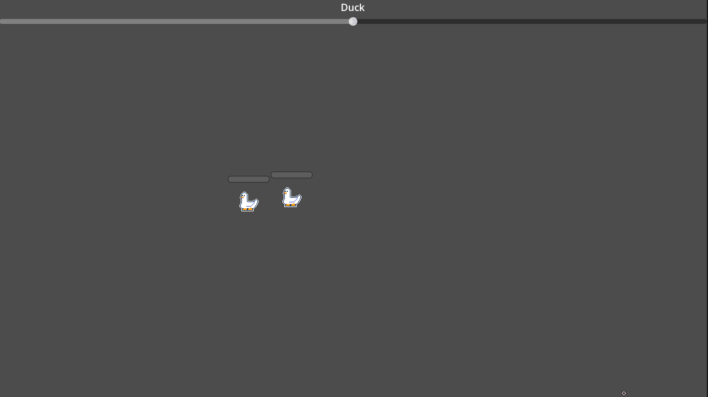

# Sprint 2 -

> Start : 08/06/2026  
> End : 21/06/2026

After few month without looking at the project for personal reasons I slowly noted some ideas until I decided to fully get back on it. 

I was pleased to see that my code wasn't so bad even if I could always improve. After looking at my last devlog I identified some goals for this sprint. 

I'm also not sure of which structure is the best to support the capture gameplay (adventure or rogue-like or something else). I like the scalability of the rogue like but I also like the mystery/easter-egg/search for the rare encounters of the adventure games. 

## Goals 

### Producing
- Make a Moscow for the project
- Put this devlog and the project on my website
- Decide a clear objective/project end  
- Godot R&D

### Design 
- Decide between linear adventure or roguelike
- If I decide start working on environement/Level/Biome etc....
- Design secondary mechanics (How to use support ducks, XP, Shops etc....)
- Document and design some duck abilities 
- Design how combo affect capture rate
  
### Code
- Implement a singleton manager system
- Make the capture mechanic work on more than one ducks
- Make the duck attack system 
- Make the duck support system 
- Add Combo/Number of loop/etc...
- Start working on the support gameplay loop (xp/Shop/etc...)
### Art 
- Try particles in godot
- Try to do some mockup/rough background
- Try to do some mockup/rough UI 
- Low priority but it's always fun to design ducks


## Design 

### Combo 

Combos are a way to reward skilled player who can do a lot of circle uninterupted by Ducks attacks or other traps.

In Pokemon ranger every 5 loops add 1/4 of the original capture rate to the capture rate. 


> For example if your starting capture rate is 12 it should evolve like this :
> |Combo|Capture rate|
> |-|-|
> |1-5|12|
> |6-10|16|
> |11-15|20|
> |16-20|24|
> |21-25|28|
> etc ....

I'll try something with this rule but I have to keep in mind that all my base capture rate should be multiples of 4. 

## Coding

### Manager system
### Refactoring the capture mechanic

I'm moving a lot of the code that was in the Cursor script into a **CaptureManager**. This way I can access it frome anywhere in the game and add tuto, bonus or other stuffs. 

I also ditched the Geometry2D.Polygon approach to use another Area2D as I did for the breaking line mechanic. This way I can detect multiples object at once with GetOverlappingBoddies(). But to use this methods I had to find a way to update the area detection on the same frame it form changes. 


So after some researchs I tried a shapecast2D, and I used the update cast methods. With this I can on the same frame :
- 1 Enable the cast
- 2 Detect if a capturable is on the cast
- 3 Launch captured methods
- 4 Disable the cast

```cs
public void DefineCircle(Vector2[] points)
{
    //Set the ShapeCast Area
    _circleAreaCollision.SetPoints(points);
    _circleShapeCast2D.Enabled = true;
    _circleShapeCast2D.ForceShapecastUpdate();
    
    //Stop here if the shapeCast collide with nothing
    if (!_circleShapeCast2D.IsColliding())
    {
        _circleShapeCast2D.Enabled = false;
        return;
    }

    //Get the node inside the casts as Capturable and launch the appropriate method 
    var bodiesCount = _circleShapeCast2D.GetCollisionCount();
    for (int i = 0; i < bodiesCount; i++)
    {
        var bodyInCircle = _circleShapeCast2D.GetCollider(i);
        if (bodyInCircle is Capturable capturableParent)
        {
            CapturableOnCircle(capturableParent);
        }
    }

    _circleShapeCast2D.Enabled = false;
}
```
> *Captured Manager Script*

I also modified the line so that when a circle is formed the circle is erased and the line continues from the ending point of the circle. 



## Art

## Conclusion

### TL;DR

|Goal   | Description                |Done|
|---|----------------|--|
|  **Making the line**    | A Line 2D follow the mouse when the right click is pressed |✔️                         
|  **Closing the circle**    | The line detect when it's making a circles |✔️
|  **Detecting inside**    | I can detect what's indside the cirle, for now it only works for one duck|➖
|  **Duck Behaviour**    | The duck can only move randomly on the screen|➖
|  **Duck interraction**    | The duck can break your line but not attack|➖
|  **Hierachy**    | What I did was functional but I can factorise more stuff (especialy around the duck behaviour)|➖
|  **Art** | I started to dabble in pixel art |➖

### Idea box

### What did I learned 
- I deepend my undertanding of area 2D especially since GetOverlappingBody did not work