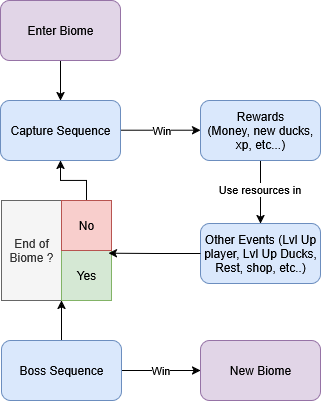
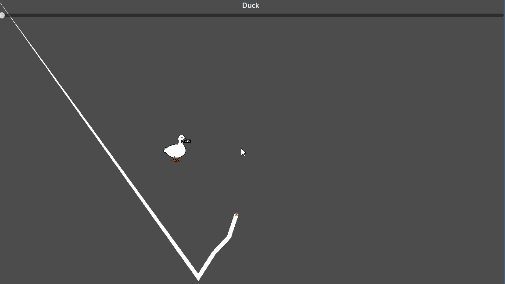
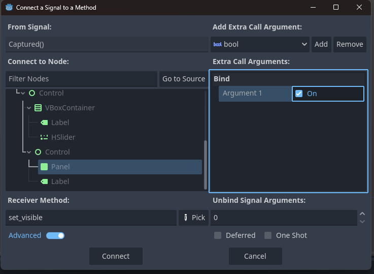
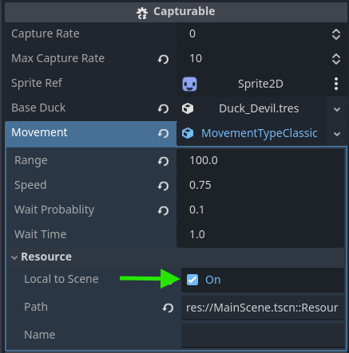
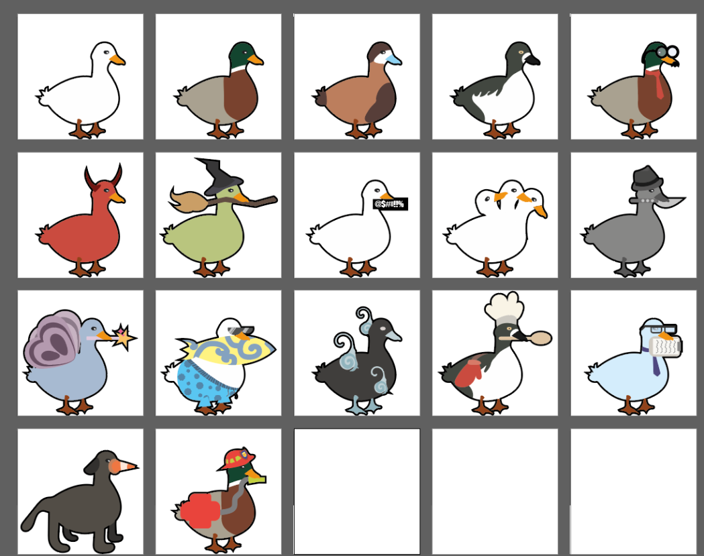
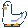
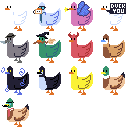

# Sprint 1 : Launching the project

I wanted to start the project with something that would show imediatly what I wanted to do with this project : the capture mechanic. I was willing to work on little stuffs around to make it more appealing and easy to test but I was mainly focused to polish this feature. 

I started godot, loaded some ducks sprites I made few month ago and started doing stuffs. 

## Goals 

My goals for this parts were : 
- Having some sort of idea of what I'm doing desing wise
- Making a line that follow the mouse
- The line can detect when it forms a circles and detect what's inside 
- Creating the base of the ducks' hierarchy 
- Creating the base of ducks' movement


## Design 

For the design of the game, I still don't really know how it's going to turn out but I have some idea of what the game would look like as a rogue-like. 

- Each run you will cross biomes
- In each biomes you will capture/Battle 2/3 ducks with a rare boss at the end 
- You can use and manage a team of ducks to assist you in your battles (active power like stat boost, reducing the stats of the opponent, status effect, AOE etc...)
- Some other event can level up your stats, your ducks stats, or heal your Hp, etc...




I also have some Idea that I will probably never implement but I want to keep somewhere :

- Artifact to power up your stats or your ducks
- A level system for your ducks 
- A difficulty system to make battle harder
- A duckdex that is filling as you capture new ducks species
- Legendary ducks/biomes that appears on special conditions
- A Starter system with the ability to unlock new starters 

## Some Coding
### Making and closing the Circle
A lot of the capture mechanic is scripted in the Capture Cursor script. This script is attatched to the Pointer GameObject. 

This object has : 
- The sprite of the pointer
- The line that detects when a circle is made
- A reference to the capture Manager to bridge the capture with the player stuffs (life, xp, stats, etc...) 
- The area2D that manage the line collision

The line is made with the help of the Line2D node of godot. When the cursor is on screen (by click on PC and by touch on phone) I check if the cursor made a gap bigger than 50 pixels from its last registered position. If it's the case I register the position and I Update the line's points positions on screen. 

```cs
private void UpdateLinePosition()
{
    _line2D.SetPointPosition(0,_pointerTransform.Position);
    
    if (_oldPos.DistanceTo(_pointerTransform.Position)>50)
    {
        var tempPos = new Vector2[_pointsCount];
        for (int i = 0; i < _pointsCount; i++)
        {
            tempPos[i] = _line2D.GetPointPosition(i);
        }

        for (int i = 1; i < _pointsCount; i++)
        { 
            _line2D.SetPointPosition(i,tempPos[i-1]);   
        }
        _oldPos = _pointerTransform.Position;

        if(LineIntersector(out var sp, out var ep))
        {
           	CircleFormed(sp,ep);
        }
        else
        {
            _line2D.DefaultColor = Colors.White;
        }
    }
}
```
>*Part of the CaptureCursor script*

I have a function that check if the line is intersecting with itself. 

```cs
public bool LineIntersector(out int startPoint, out int endPoint)
{
    for (int i = 0; i < _line2D.GetPointCount() - 1; i++)
    {
        var sPoint = _line2D.GetPointPosition(i);
        var ePoint = _line2D.GetPointPosition(i + 1);

        for (int j = i + 2; j < _line2D.GetPointCount() - 1; j++)
        {

            var sPointBis = _line2D.GetPointPosition(j);
            var ePointBis = _line2D.GetPointPosition(j + 1);
            var intersection = Geometry2D.SegmentIntersectsSegment(sPoint, ePoint, sPointBis, ePointBis);

            if (intersection.VariantType == Variant.Type.Vector2)
            {
                startPoint = i;
                endPoint = j + 1;
                return true;
            }
        }
    }
    startPoint = 0;
    endPoint = 0;
    return false;
}
```
>*Part of the CaptureCursor script*

### Detecting What's inside

The line is considered as closed once two points are **interecting**. If it's the case I can create a polygon using the two points as encapsulation. Every points between thoses two are part of the polygon.

If it's the case I then check if something is in the circle, if it's the capturable, I raise it's capture rate.  

```cs
private void CircleFormed(int startIntersectionIndex, int endIntersectionIndex)
{
    if(DetectObjectInCircle(_detectObject.Position,startIntersectionIndex,endIntersectionIndex))
    {
        _detectObject.RiseCaptureRate(TEMP_playerStrengh);
        ResetLine();
    }
}

private bool DetectObjectInCircle(Vector2 pos, int arrayStartCircle, int arrayEndCircle)
{
    var arrayCircle = new ReadOnlySpan<Vector2>(_line2D.Points, arrayStartCircle, arrayEndCircle - arrayStartCircle);
    var ret = Geometry2D.IsPointInPolygon(pos, arrayCircle);
    return ret;
}
```
>*Part of the CaptureCursor script*

I'm happy that this works but I have few problems that comes to mind :

- It only works with one duck and I want to be able to capture multiples duck in one capture session
- It's a bit heavy and can use some refactoring
- It could be optimized with some object pooling 

### Creating Ducks

I created a straightforward object with a capture Rate that can rise and be reduced. 

The "new" thing for me on this script was to get acclimated to Godot's signals system again. On this instance I use it to manage feedbacks (mainly UI) in the future without having to touch this script again. 

```cs
// Part of the sc_Capturable Script 
public partial class Capturable : StaticBody2D
{
    [Export] private int _captureRate, _maxCaptureRate = 100;

    [Signal]
    public delegate void CaptureRateChangedEventHandler(int newRate);

    public void ChangeCaptureRate(int newRate)
    {
        _captureRate = Mathf.Clamp(newRate, 0, _maxCaptureRate);
        EmitSignalCaptureRateChanged(newRate);

        if (_captureRate >= _maxCaptureRate)
        {
            Capture();
        }
    }
}
```
>*Part of the Capturable script*

If the capture rate is full, the duck is captured and the capture session can end. 



As a place holder, I created a Captured signal launched when the capture is completed. Of course later I'll have to change scene, give the players rewards etc... instead of a plain display of text.  

With this I learned about the Advanced Signal in godot that avoid me to create complicated delegate for my signal. That's pretty neat. 




After this I created a Duck resources that contains Duck Related Info (Sprites, Capture Rate, Name etc...) this resources is "read" by the Capturable Script to load the duck information to the main scene.

```cs
public partial class DuckResource : Resource
{
    [Export] private string _inGameName;
    public string InGameName => _inGameName;

    [Export] private Texture2D _duckSprite;
    public Texture2D DuckSprite => _duckSprite;
    
    [Export] private int _baseMaxCaptureRate;
    public int BaseMaxCaptureRate => _baseMaxCaptureRate;
}
```
> *Part of the Duck Resource Script*

<br />

```cs
    [Export] private DuckResource _baseDuck;
    public void InitialiseDuck()
    {
        _maxCaptureRate = _baseDuck.BaseMaxCaptureRate;
        _spriteRef.Texture = _baseDuck.DuckSprite;
        _captureRate = 0;
    }
```
> *Part of the Capturable script where the Duck resource is loaded*

<br />

I'll just have to add new info to the Duck Resource script if I need to add new stats or info to the ducks. 


### Duck Behaviour : Movement


For my Ducks movement I wanted to use the strategy design pattern : I Created a MovementType abstract Resource with a ProcessMovement method called by the Capturable script. 

```cs
[GlobalClass]
public partial class MovementType : Resource
{
    public virtual void ProcessMovement(Capturable capturableRef, double delta)
    {
        
    }
}
```
> *MovementType resource script* 

<br/>

```cs
[Export] private MovementType _movement;
public override void _Process(double delta)
{
    base._Process(delta);
    _movement.ProcessMovement(this,delta);
}
```

> *ProcessMovement Is called in the Capturable Script*

<br/>

By implementing this feature, I learned about the Local to Scene option on Godot's resources, it solves a lots of things for me as I was wondering if resources would have behave exactly like Scriptable Object on Unity. (In unity you cannot change a var of your Scripatble Object without changing it for EVERY instance that use it. In Godot this option prevent that).

This feature allows me to use local and private var on my MovementType and fully exploit the Strategy Design pattern. 




Right now the movement is handled by the Callable script but my next step is to put it on the Duck Ressource script. For that I'll have to understand if both resources (Movement and Duck) have to be Local to Scene or not.


Next I'll have to create resource that inherits from MovementType and override the ProcessMovement method. For exemple I started with a simple movement that targets a point on a radius around the Duck and it lerps towards this point. Sometime the Duck can wait instead of moving.

```cs
[GlobalClass]
public partial class MovementTypeClassic : MovementType
{
    [Export] private float _range = 3, _speed = 1, _waitProbablity =0f, _waitTime = 1;
    private bool _wait;
    private Vector2 _originalPosition,_nextPosition;
    private float _lerpT = 1, _waitT = 1;
    public override void ProcessMovement(Capturable capturableRef, double delta)
    {
        if (_lerpT>=1|| _waitT>=_waitTime)
        {
            _lerpT = 0;
            _waitT = 0;
            _wait = GD.Randf() < _waitProbablity;

            if (!_wait)
            {
                _originalPosition = capturableRef.Position;
                var x = (float)GD.RandRange(-1f, 1f);
                var y = (float)GD.RandRange(-1f, 1f);
                
                _nextPosition  = capturableRef.Position + ((new Vector2(x, y)).Normalized()*_range);
                
            }
        }
        if (_wait)
        {
            _waitT += (float)delta;
        }
        else
        {
            _lerpT += (float)delta*_speed;
            capturableRef.Position = _originalPosition.Slerp(_nextPosition, _lerpT);
        }
    }
}
```
> *Basic MovementType that inherits from MovementType script*

<br/>

I had to write a bit of code to prevent the Ducks to escape from the screen. It's not the most difficult task ever but it gave me the push to create a vector extention script that I could used later.

```cs
public static class VectorExtention 
{
    public static Vector2 Vector2Clamp(this Vector2 value, Vector2 min, Vector2 max)
    {
        var x = Mathf.Clamp(value.X, min.X, max.X);
        var y = Mathf.Clamp(value.Y, min.Y, max.Y);
        var ret = new Vector2(x,y);
        return ret;
    }
}
```
> *Vector Extention Script*


## Art

I tried few things to find an art that suit me. I already had some Illustrator files of ducks but idk the art style did not fit with this project for me. 


> *1st itteration on illustrator*

But it was a good starting point for me as I already had some ducks design. 


> *1st Pixel art itteration*

I fumbled a little bit with some pixel art until I found something I liked for this prototype.



> *2cnd Pixel art itteration*

I know the art is going to evolve again but i'm happy to have some ducks to put in the game 🦆

## Conclusion

### TL;DR

|Goal   | Description                |Done|
|---|----------------|--|
|  **Making the line**    | A Line 2D follow the mouse when the right click is pressed |✔️                         
|  **Closing the circle**    | The line detect when it's making a circles |✔️
|  **Detecting inside**    | I can detect what's indside the cirle, for now it only works for one duck|➖
|  **Duck Behaviour**    | The duck can only move randomly on the screen|➖
|  **Duck interraction**    | The duck can break your line but not attack|➖
|  **Hierachy**    | What I did was functional but I can factorise more stuff (especialy around the duck behaviour)|➖
|  **Art** | I started to dabble in pixel art |➖

### Idea box

- I could use the capture mechanic to "capture" other stuffs like traps or permanent attacks.
- Peas as currency and/or XP.
- Bad Guy is bread related because bread is bad for ducks.

### What did I learned 

I learned a lot about some of Godot nodes and hierachy. I'm still unsure about how to uses and optimize the 2D collisions. I'm still using basic godot stuffs.

I'm more confortable with geometry stuffs lilke **Area2D**, **Line2D**, etc... 

I Made a HUGE break after this 1st session for personal stuff so I figured I will set up some deadline for each sprints. 

I'm also figuring out how to organize theses docs as I'm writing them so some stuffs might change in the future. 
