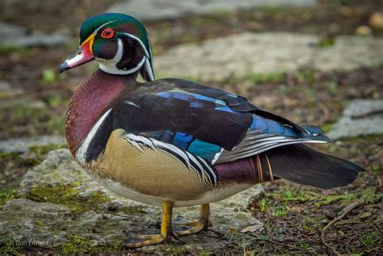

# Sprint 3 

I'm still dabbling with what I'm doing here but I think I might have goal oriented rahter than time oriented sprints. This way at the start of a sprint I know I'm going to focus on X Design task X Coding task etc...

That way I'm not letting myself be overflowed by an infinite number of tasks. Of course some task are note finite but I'll see as I go. 

Anyway the weather is MUCH more bearable now and it's time to work with ducks. 

> A wonderful wood duck

## Goals 

For this sprint this is what I want to focus on 

### Design
- Design the combo system
- Design the support system
  
### Producing 
- Create a Moscow like doc for the project

### Code
- Implement the combo system
- Implement the support system

### Art
- Create a first batch of rough Bacground elements  
- Draw at least 2 New ducks 
  
### R&D
- Look for how to do particles in Godot 
  

## Design 
## Producing
## Code
## Art
## R&D
## Conclusion
### TL;DR
### Idea box
### What did I learned 