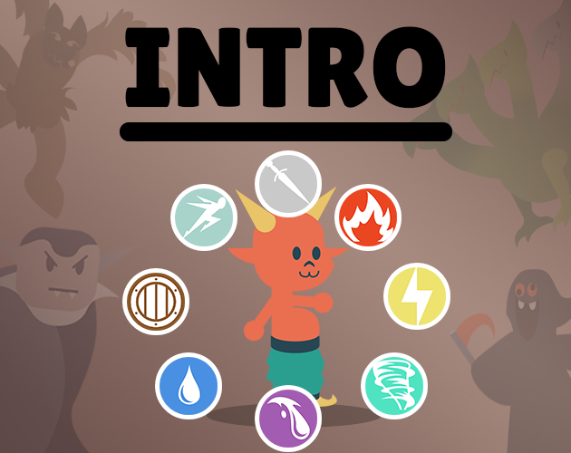
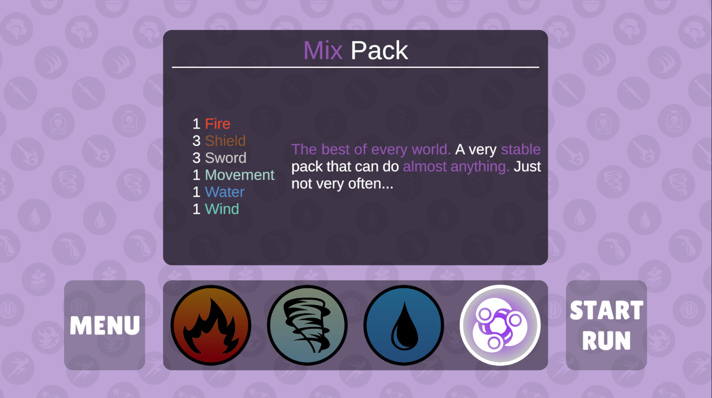
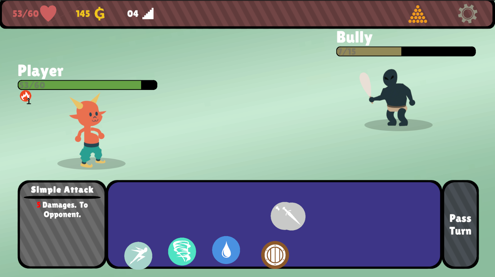
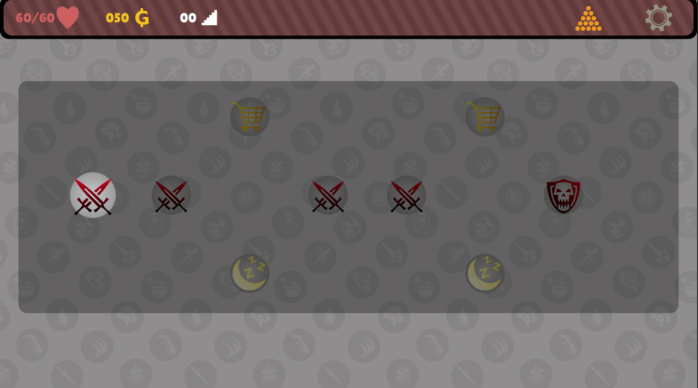
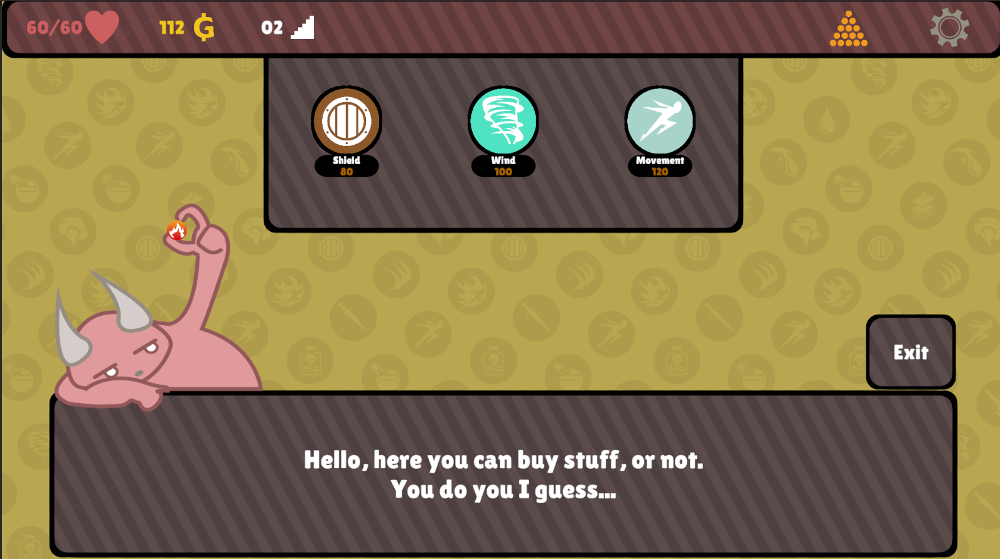
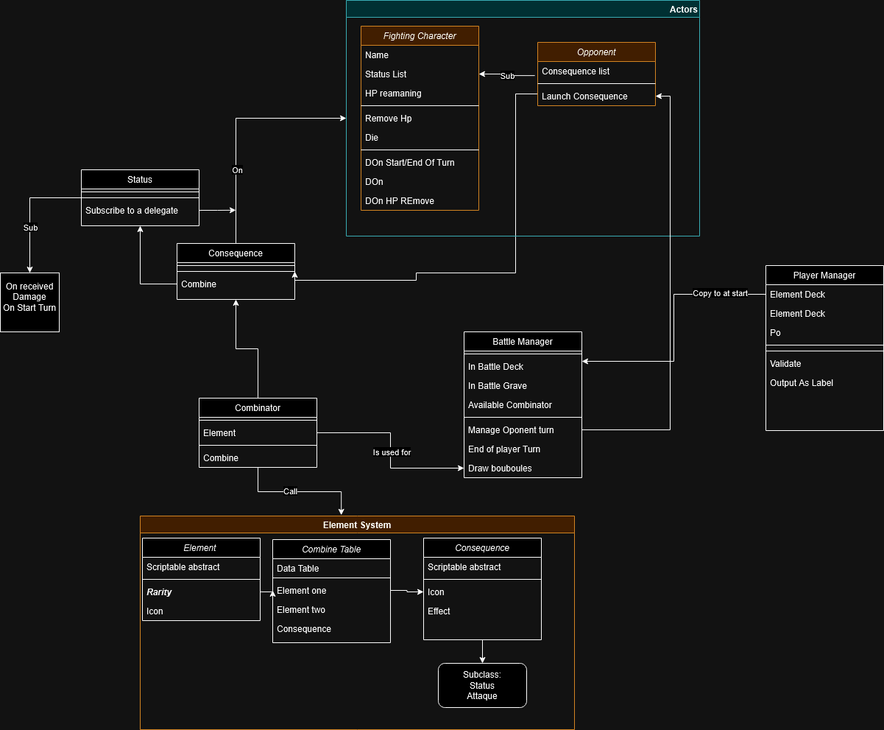
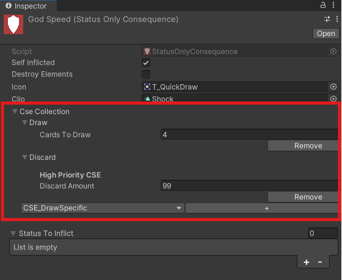
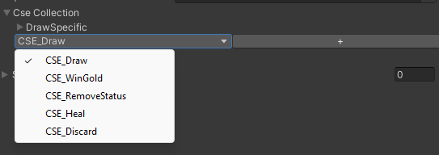
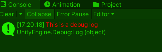
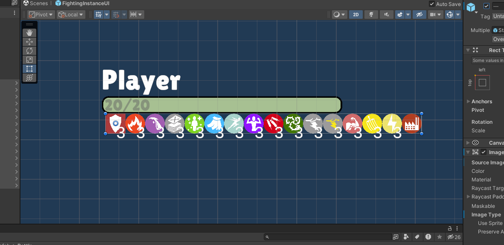

# Intro


>🚹 Personal Project    
>🕖 2 Months   
>👨‍💻 Unity - C#  

<p align=center>

</p>

## 📋TL;DR

This devlog document is a lot more long that I anticipated so If you only want to know the big lines of my experience on this project :

- The game is a rogue like game builder. You combine elements to launch action in turn based combats. 
- I have a finished prototype with 3 level and a fully functioning system
- I used my Unity Editor skills and my sense of code architecture to create a very flexible project
- I made few mistakes and faced few problems, mainly with some deep editor related stuffs and I'm happy to have learned a lot thanks to that
- I needed to polish an old Unity plugin that I made so I finished it ! ([link here]())
- I'm proud of my design and code architecture. I tried not to go in every directions and to keep the scope of the project realistic

Anyhow if you have the time to read the whole devlog I really appreciate it 😀


# The Game 

## 🔎**Context** 

In the summer of 2024 I decided to make a system based game to have something to show and to share to my students as an exemple. 

These last years I have been playing a lot of Deckbuilding Rogue like (Balatro, Slay the spire, Astrea, Wildfrost etc...) and I have been thinking about what would be my take on the genre for a little while. 

The project I wanted to do for my students was the occasion to put this idea to the test. 


My idea was to make a game where the player can launch action by combining elements. I started brainstorming and a lot of ideas came to my mind so I launched Unity and worked on the first prototype. 


## 💡**Concept**

The game is a rogue like deckbuilder. 

You will progress in realms, each one make you battle 4 foes, before facing a powerfull boss.  

The battles are turn based and you use a deck of **elements**. Each turn you draw elements and you can combine them to launch attack, draw more elements, heal you, or many other things. 

Each time you'll defeat a foe you'll win monney and play the lotterie to win a random element to add to your deck.

After every 2 battles you can either rest to heal your HP or remove an element in an Inn or spend your money to add elements in a shop.


### **Glossary**

> **Element** : *Your deck is filled with elements. By combining them you can launch consequences.*

> **Consequences** :  *Theses are the actions you can launch with elements, your foes will launch one consequence every turn too. They can buff you, heal, inflict dammage and more !*

> **Status Effects** : Some consequences will give you or your opponent status effects. They can do a lot of different things like healing or damaging but also affect your precision, block dammages, and even generate elements!

> **Rest Area** : That's where you can either delete elements from your deck or heal few HP

> **Shop** : That's where you can buy new elements to add to your deck


## 🔮**1st Scope and future of the project**

I wanted to make a 1st prototype of the project that would allow me to experiment with the concept and show a peak of the gameplay loop without going in all directions.

Here's what I hoped to do at the start of the project and what I've done.

### Gameplay 

|Objective|Done|Comment|
|---|---|---|
|3 Realms|✅||
|4 types of foes and 1 boss/Realm|✅||
|10ish elements|✅||
|20ish Consequences|✅||
|Small Feedbacks and Fxs|✅|Really small stuffs like fade in/out animations HP update etc...|
|Shop and rest area|✅|
|Ergonomic and QOL|✴️|You can preview what the foe is going to do and what combinaison your going to have but some stuffs are missing|
|Job System|❌|I did not implement jobs with abilities and stufss but you can choose differents starting decks|
|Relics and items|❌|I focused on having a strong system and didn't want to mess it up by adding more stuffs|

### Tech
 
|Objective|Done|Comment|
|---|---|---|
|Scriptable Object architecture that'll allow me to create a lot of consequences|✅||
|Tools that facilitate consequence management|✅||
|Observer pattern Implementation for UI and feedbacks|✅||
|Procedural management |✴️|Each foe is randomly selected from a selected pool and the items you can buy are random but there are no procedure or algorithme yet|
|InGame Debug Tools|✅| I have cheat Code and stuff ingame


### Future of the Project 

Now that I programmed a strong and flexible system, I would like to add more content (elements, consequences, status, etc...) and a true structure to the game. 

Here's the stuffs I have been thinking about :

- Job/Character system
- Skins
- Relics and Items
- Game Progression (Unlockable Decks, elements, etc...)
- 2 Currency (one in run/ one to unlock stuffs outside of the runs)
- Other Game mode (Puzzle/Challenge, etc...)
- Seed system

# Screenshots








# What I did

## 🏛️ Architecture

I wanted to make a system that allowed me to create a lot of content quickly. To do that I had to have a really good hierarchy and architecture.

You can find here a rough diagram of my code structure. 



### Elements

I started by coding Elements and consequences. This stuff would be really data oriented so I choosed to use Unity's Scriptable Object. 

Elements are key part of the project structure but they didn't need to be realy complicated. They only needed to have informations that will be used by other scripts. 

A name, a base price for the shop, a description, a color, and few elements that could combine with it to gives hint to the player. 

```cs 
using System.Collections;
using System.Collections.Generic;
using UnityEngine;

[CreateAssetMenu(fileName ="New Element", menuName ="MyStuffs/Element")]
public class Element : ScriptableObject
{
    public Sprite icone;
    public int basePrice=111;
    public string description;
    public Color color;
    public Element[] potentialMix;


    public string GetColoredElementName()
    {
        return name.ColorizeString(color);
    }
}
```

### Consequences

On the other hand, consequences needed to be a bit more complex. 
I needed to make consequences to have theses caracteristics : 
- Easy to call in battle,
- Easy to experiment with (add and remove new behaviour, status, etc...)
- Can be called by the player and the foes

The best course of action for me was to use a mix of the composite, decorator, and observer design pattern. 

I created an abstract parent Consequence class that will be called by the *Fighting Instance* (Player character and foes) in battle, and will manage : 

- Who call the consequence
- Who is the target of the consequence
- If the consequence have consequence special effect (or CSE) (Discarding elements, healing, drawing new elements, etc...) ([see bellow](#cse))
- Some data stuffs (name, description, icon, etc...)


Every consequence have a ***Call Consequence*** function that will be called by the *Fighting Instance*. This function has two parameters, both are *Fighting Instances* the launcher and their opponent.

> ***Call Consequence*** 1st determine who is the target (launcher or opponent), call the main consequence (dammage, status, etc...) then, if the consequence have CSE they are called, then feedbacks are called. 

[The Consequence Script](https://github.com/LouisViktorCeleyron/Intro/blob/main/Assets/Scripts/Gameplay/Consequences/Consequence.cs)

I then thought about the best way to use inheritance on this class to have the least amount of child classes: 

- I needed a class that would inflict status to the target (more on that later)
- I needed the status class to have a child class that might inflict status and add or remove HP to the target.
- I needed a special class for the factory consequences. 

I know I could have merge the consequence parent class and the status consequence class but I liked the Idea to have a non-status related parent 

### Status 

The status were a huge part of the project, a lot more than I anticipated, but I'm really satisfied with the result. 

For the status I choose to only use inheritance to structure and observer to apply them. 

> The *FightingInstances* have few delegates (at the start and end of the turn, when attacked, etc...) the status structure goal is to call every status at the right time with theses delegates

The parent class has :
- A ref to the target, so the status can affect its stats, hp, etc...
- An amount  variable, that can be changed by coresponding methods 
- A Subscribe and Unsubscribe methods to choose to which one of the delegates this status will be bind
- UI stuffs I will describe more [here](#display-of-status-in-ui)


The amount variable is used in different ways for every status effects, some will define the power of the status, some the number of turns the status will affect the target etc...

The **FightingInstance** class has a function to add the status:

```cs
public T AddStatus<T>(int amount) where T : Status, new()
{
    var currentStatus = statusEffects.Find((Status s) => s.GetType() == typeof(T));
    if (currentStatus != null)
    {
        currentStatus.ChangeAmount(amount);
    }
    else
    {
        currentStatus = new T();
        currentStatus.Inflict(this,amount);
        statusEffects.Add(currentStatus);
    }
    OnStatusInflictedFeedback.Invoke(currentStatus.StatusEnum, currentStatus.Amount);
    
    if (currentStatus.Amount <= 0)
    {
        statusEffects.Remove(currentStatus);
    }
    else
    {
        if(_lockAntiStack == false)
        {
            _lockAntiStack = true;
            OnStatusInflicted.Launch(currentStatus);
            _lockAntiStack = false;
        }
    }
    return currentStatus as T;
}
```


I faced few problems to create a system that would take account of most of possible exceptions. 

That's why I have methods called before and after the amount is changed, when the status is inflicted, when the status is removed, etc... I tried to not overload my scripts though !


[The folder where you can find all status related scripts](https://github.com/LouisViktorCeleyron/Intro/tree/main/Assets/Scripts/Status)


### CSE

CSE are extra effect that could be called by any consequences, to avoid an inheritance hell (like having a class for status effect that can draw, one for attack that can draw, one for attack that can draw AND heal, etc...) I used the decorator pattern.

I created a class called *ConsequenceSpecialEffect*, i created a child class for every type of CSE I needed, and I created a *CseCollection* to avoid making the Consequence Script too messy. 



I had a problem to make the CSE as easy as possible to edit in the inspector, but I talk a bit more about this issue [here](#editor)

I'm pretty happy of how the CSE turned out: I can put as many as I want in my consequences and they are highly editable. 
The only thing a bit annoying is to have to create a new class for every kind of CSE. 

[The CseCollection Script](https://github.com/LouisViktorCeleyron/Intro/blob/main/Assets/Scripts/Gameplay/Consequences/SpecialEffects/CseCollection.cs)

[The ConsequenceSpecialEffect Script](https://github.com/LouisViktorCeleyron/Intro/blob/main/Assets/Scripts/Gameplay/Consequences/SpecialEffects/ConsequenceSpecialEffect.cs)


## ✂ Editor

Working on tools and editor stuffs is one if my favorite way to work on a game. This project is no exception: I had a lot of fun making tiny and big tools for this project.

On this project I mainly used **Property Drawer**, something I was prepared for thanks to the [BasePropertyDrawer]() I made some time ago :

I used the editor to make the CSE waaaaayyyyyy easier to edit in the inspector : 

This way I can add and edit as much CSE as I want and I have a fully in editor decorator pattern. 

The hard thing was to detect all the class that inherits from CSE and made them as a popup.     



The way I do that is simple : I use the **GetAllSubclassOf** method to get all subclass of CSE. 

```cs
/// <summary>
/// Get A list of all Type that are a subclass of the given parent
/// </summary>
public static List<System.Type> GetAllSubclassOf(this System.Type parentClass)
{
    var _return = new List<System.Type>();

    //Get the assembly
    var _assembly = parentClass.Assembly;

    //Foreach on all type in the assembly
    foreach (var _type in _assembly.GetTypes())
    {
        //Check if t is a child of Node Editor
        if (_type.IsSubclassOf(parentClass))
        {
            //Add to the list if it's so
            _return.Add(_type);
        }
    }

    return _return;
}
```


Once I got that I can, after a bit of safety check, turn them in to string and put them in the popup. If selected and added to the CSE List I Used **System.Activator.CreateInstance()** to create and add the object to the list. 

By doing that I mainly learned how to use the **System.Activator** instead of creating ScriptableObject hidden for every object and subobject I needed. 

I Know I could later use **ReorderableList** and **Undo** to make this more user friendly.

You can find the CSEEditor Code [here](link)

## 🎨 Other stuffs

### Colorizing my Debug Logs

A tiny script I did that came REALLY handy was the **Colorizing Debug Log**. It does exactly what it says and it allow me to filter my logs.



```cs
public static class ColorizeExtention 
{

    public static Color StatsColor => Color.blue;
    public static Color DammageColor => Color.red;
    public static Color GoldColor => Color.yellow;


    public static string ColorizeString(this object s, Color color = default)
    {
        return $"<color=#{ColorUtility.ToHtmlStringRGB(color)}>{s}</color>";
    }
}
```

I'll probably add this script to my toolbox!

### Descriptions

I'm proud of the way I generate description on my actions.


It's a simple **ToString()** method but I use a sort of Russian Doll hierarchy of descriptions :

Each Consequence Subclass gets the descriptions from the inflicted status and CSE. The dammage that's going to be inflicted is calculated and displayed. Then the target. 

```cs
public virtual string GetDescription(FightingInstance launcher = null)
{
    var ret = _cseCollection.GetDescription() + " To " + GetTargetName() + ". ";
    var destroyRet = destroyElements?"Remove Element from Pack Until the end of the battle. ":string.Empty;
    return destroyRet+ret;
}
```
> *The base consequence description that add the CSE*

```cs
public override string GetDescription(FightingInstance launcher = null)
{
    var retStatus = string.Empty;
    var retInverseTarget = string.Empty;
    foreach (var status in statusToInflict)
    {
        var amountShieldTEMP = status.effect == StatusEffect.Shield && launcher!= null? launcher.Stats.Bulk : 0;
        var currentRetStatus = $"{(status.amount + amountShieldTEMP).ColorizeString(ColorizeExtention.StatsColor)} {status.effect}";
        if(status.inverseTarget)
        {
            var retTargetTarget = !selfInflicted ? "self" : "oponent";
            retInverseTarget += $"{currentRetStatus}, to {retTargetTarget}.";
        }
        else
        {
            retStatus += currentRetStatus+". ";
        }
    }
    var retBase = base.GetDescription(launcher);

    return retStatus + retBase + retInverseTarget;
}
```
> *The status subclass displays the status with every cases* 

```cs
    public override string GetDescription(FightingInstance launcher = null)
    {
        var launcherStat = launcher != null? launcher.Stats.Strength : 0; //Adding the strengh status to dammage
        var retBaseDam = $"{(baseDamages+launcherStat).ColorizeString(ColorizeExtention.DammageColor)} Damages. ";//How many dammage the atack will do
        var retRecDam = $"{recoilDamages.ColorizeString(ColorizeExtention.DammageColor)} Recoil Damages. ";// If it has recoil dammage 
        var retAmount = $"{howManyTimes.ColorizeString(ColorizeExtention.DammageColor)} Times. ";// How many time
        var retBase = base.GetDescription(launcher);//Get status from base class
        return retBaseDam + (recoilDamages>0?retRecDam:string.Empty) + retBase + (howManyTimes>1?retAmount:string.Empty); //combine everything into a string
    }
```
> *Finally the offensive consequence is displaying the dammges/healing*

### Battle System

The battle system is managed thanks to the **BattleManager** class. I use a coroutine with the **WaitUntil** command to manage the player and enemy turns. Each step of the battle a delegate is called to launch feedbacks and to manage status effects. 


### Display of status in UI

To display my status in UI i added every status icon to my battle UI. 



Then in the status parent class I have a Status enum virtual property that every subclass implement.

```cs
public override StatusEffect StatusEnum => StatusEffect.ThunderMarked;
```
> *For example the subclass of the ThunderMarked status*

In Battle a **MasterBattleUI** script has a dictionary that allow me to link a status enum to a status icon so when the status are updated the correct icons are displayed.

I also have a status description panel that indicate what the status does. 

Every status has a **GetDescription** method that indicate what the status will do with the current amount. 

```cs
public override string GetDescription()
{
    return $"I will receive {Amount.ColorizeStatusString(true)} damages at the start of my turn, then lose 1 stack";
}
```
> *The poison status GetDescription*


### Debugger

I made an in-game debugger that can be accessed with CTRL+E that allow you to draw any element from the game, Buff your character or heal them. 


It's really handy when I have to try new consequences or to go through difficult battle when I have to test something else. 

It's available in the build. 

# Links

You can find my game design doc, with every elements, combinaison, etc... [here](https://docs.google.com/spreadsheets/d/1h9zG16REBftnj_vJVHQ-YPOQ1HlRdiy30p6ICMqrrNc/edit?usp=sharing)

[Link to download the prototype](https://laoil.itch.io/intro)

[Link to the project repo](https://github.com/LouisViktorCeleyron/Intro)

[Link to the project documentation](https://docs.google.com/spreadsheets/d/1h9zG16REBftnj_vJVHQ-YPOQ1HlRdiy30p6ICMqrrNc/edit?usp=sharing)

***

[Get back to the project page](https://github.com/LouisViktorCeleyron/Portfolio/blob/master/Projects/MyProjects.md)  
[Get back to the main page](https://github.com/LouisViktorCeleyron/Portfolio/blob/master/README.md)
