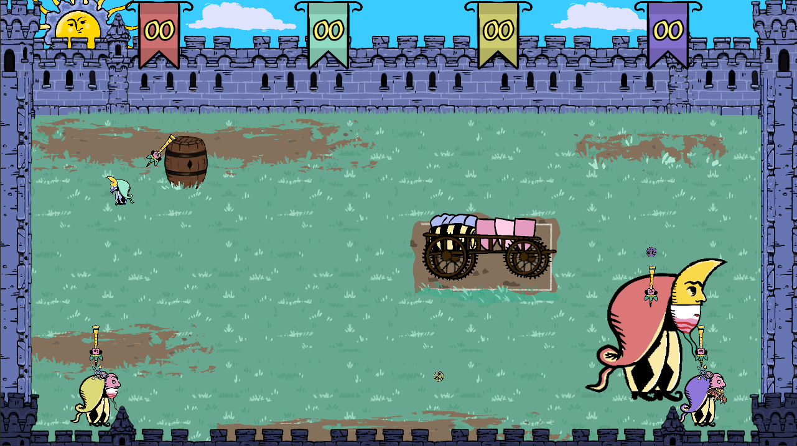

# Jams

I'm really fond of Game Jams, both as an organizer and a participant. As a students, between 2015-2020 I was a member of the student association of my school and I was in charge of organizing 2-3 jams a year. 

As a teacher I also pushed my students to join at least one jam/year and I even organized a GGJ at my campus in 2025. 

As a participant I usually join a team as a Game Dev and Game designer but I'm not against trying new thig if I have the time ! 

You can find bellow my projects for the 3 last GGJ. 

## 1v1 Parking Du Chateau (2026)
>👨‍💻Godot PC (C#)     
>🚹 4 People    
> Arcade Shooter (2-4 players)

### Concept

This jam theme was Mask.    
Parking is a chaotic arcade Twin-Stick shooter. Every player controls a medieval jester that must shoot the other one to be the last one stanting in the King court.  
The twist is, every player has a random mask that will alter their shooting and movements. 



### What I did

I was the only programmer on this project and this was my first team project on Godot. I had a little trouble making the Version Control work as a team with godot but once i had the jist of it everything was ok. 

Because I'm more experienced in system programming than 3C programming so I first made the mask and score system then I had the time to focus on mastering the 3c programming in godot. 

For the 3C programming I used my current favorite Design Pattern : **Composite** : 


Every behaviour inherits a **Module** class and the player script calls and refers to every modules attached to them. And Evry module can access every other module of their owner. 

Every mask is a Module and is either a top mask or a bottom mask. At the start of a game every player will have a random combination of any top and bottom masks. 

The Tops affect how the player move and the bottoms affect how they shoot. 

The **MovementModule** script has delegates that can add conditions and/or effect to shoots and movement. And the **ShooterModule** script will get the bullet to spawn from the Bottom Mask Module.

```cs
using Godot;
using System;

public partial class TopChangeShooting : TopMask
{
	private MovementModule _movementModule;
	public override void _Ready()
	{
		base._Ready();
		var shootModule = _owner.GetModule<ShooterModule>();
		_movementModule = _owner.GetModule<MovementModule>();
		shootModule.AddCondition(ShouldShoot);
	}

	private bool ShouldShoot()
	{
		return _movementModule.Velocity.Length()<0.0001f;
	}
}
```
> *Example of top mask script*          

```cs
using Godot;
using System;

public partial class RecoilBullet : BulletBody
{
	private double _t;
	private Vector2 _impulse;
	[Export]
	private float _impulseForce=500f;

	private MovementModule _movement;
	public override void Launch(PlayerRef owner)
	{
		base.Launch(owner);
		_t = 0.2;
		_movement = _owner.GetModule<MovementModule>();
		_movement.AddMovement(Impulse);
	}
	
	private void Impulse(double delta)
	{
		_impulse = Vector2.Zero;
		base._PhysicsProcess(delta);
		if (_t >= 0f)
		{
			_t -= delta;
			var impulseDir = -Transform.Y.Normalized()*_impulseForce;
			_impulse.X = Mathf.MoveToward(impulseDir.X,0,0.2f);
			_impulse.Y = Mathf.MoveToward(impulseDir.Y,0,0.2f);
			_owner.Velocity = _impulse;
		}
		else
		{
			_movement.RemoveMovement(Impulse);
		}
	}

	public override void _ExitTree()
	{
		base._ExitTree();
		_movement.RemoveMovement(Impulse);
	}
}
```
> *Exemple of Bottom Mask*

This way the system works no matter how many masks we wants to add in the game, I can create more masks and bullets without having to change anything in the main modules.  

Here a tiny table of whitch mask does what:
|Mask|Position|Effect|
|---|---|---|
|Bouncing|Bottom|The bullet bounce against the walls|
|Heavy|Bottom|The bullet is VERY Slow but last longer
|Recoil|Bottom|The player has some recoil when they shoots
|Inverted|Top|The player has inverted Control
|Size|Top|The player will change size when they move
|ChangeShoot|Top| The player can't shoot and move at the same time

The project was fun, working with godot is REALLY fun and I had the occasion to make a clear, stretchable and reusable code on this engine. 

### Links
[The game Repo](https://github.com/LouisViktorCeleyron/GGJ2026)   
[The game GGj Page](https://globalgamejam.org/games/2026/1v1-parking-du-chateau-6)   
[The Game Itch.io Page](https://laoil.itch.io/1v1)

## Volley Bulle (2025)
>👨‍💻 Unity - PC  
>🚹 5 People    
> Sport Game (2 players only)


### Concept
### What I did
### Links
[The game Repo]()   
[The game GGj Page]()   
[The Game Itch.io Page]()

## Cat-A-Strophe (2024)
>👨‍💻 Unity - Mobile  
>🚹 5 People    
> Puzzle / Point'n'click

### Concept
### What I did
### Links
[The game Repo]()   
[The game GGj Page]()   
[The Game Itch.io Page]()
