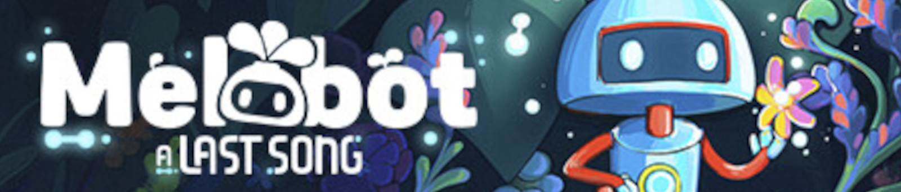

# Melobot A last song
> Anomalie Studio - Remote
> Freelance mission - 2020-2021 - 5 months mission  
> Unity - C#  
> Team of ~10  
> General Programmer 

## Context

**Melobot - A last song** is a top down adventure game with music based features. The game centers on a tiny robot with unlockable capacity in a medroidvania-like structure. 

It's made by **Anomalie Studio** and was released in 2024 on **PC, Playstation and Xbox**. I worked on this game on the early stages of the project so I essentially did some prototyping and tested some tools.   

## What I Did

I had to code a lot of little feature on this project; I help prototyp

## What I Learned

FMod
Git related tool 

## More about this project

[What I did](Melobot/Melobot.md)     
[Trailer](https://www.youtube.com/watch?v=2sHevzBmdKs)  
[Steam Page](https://store.steampowered.com/app/1937670/Melobot__A_Last_Song/?l=french)
 
***

[Get back to the project page](https://louisviktorceleyron.github.io/Portfolio/Projects/MyProjects.md)  
[Get back to the main page](https://louisviktorceleyron.github.io/Portfolio/README.md)
